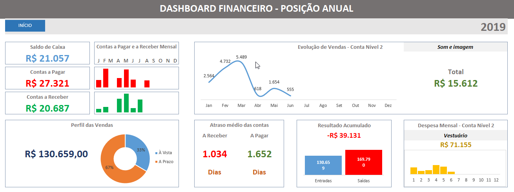

## 📁 Projetos

### 1) Projeto Fluxo de Caixa (Excel)

**Problema:** baixa visibilidade do caixa e do resultado mensal/acumulado.  
**Solução:** base de lançamentos + categorização + painel executivo (mensal/anual).  
**Entrega:** dashboard com **Entradas x Saídas**, **Saldo**, **Resultado acumulado** e **análises por categoria**.

**O que o dashboard mostra**
- KPIs: Total Entradas, Total Saídas, Saldo do mês, Resultado acumulado
- Gráficos: evolução mensal, distribuição por categoria, comparativos por período
- Estrutura: base de dados + painel (visão executiva)

**Impacto**
- Centraliza o controle financeiro e acelera a leitura do resultado do período
- Ajuda a identificar rapidamente categorias que mais impactam o caixa

**Tech / Skills**
- Excel (Tabelas), fórmulas, validação de dados
- Gráficos e construção de KPIs

**Arquivo:** `1. Projeto Fluxo De Caixa.xlsx`

---

### 2) Projeto Perfil do Cliente
**Arquivo:** `2. Projeto Perfil do cliente.xlsx`  
**Objetivo:** analisar perfil e segmentação de clientes, padrões de comportamento e indicadores relevantes.  
**Destaques:** estruturação de dados, insights de perfil e métricas para tomada de decisão.

---

### 3) Projeto Ativos
**Arquivo:** `3. Projetos Ativos.xlsx`  
**Objetivo:** controle e análise de ativos, com visão de status, acompanhamento e organização.  
**Destaques:** padronização de base, indicadores e acompanhamento operacional.

---

### 4) Projeto Painel de Vendas
**Arquivo:** `4. Projeto Painel de Vendas.xlsx`  
**Objetivo:** acompanhar performance de vendas com KPIs, tendências e análises por período.  
**Destaques:** painel gerencial, gráficos, visão comparativa e métricas de desempenho.

---

### 5) Projeto de Registro de Pagamento Autônomo
**Arquivo:** `5. Projeto de Registro de Pagamento Autônomo.xlsx`  
**Objetivo:** registrar pagamentos e controlar histórico, valores e status de recebimentos.  
**Destaques:** controle de registros, organização financeira e acompanhamento de pagamentos.

---

### 6) Projeto Financiamento
**Arquivo:** `6. Projeto Financiamento.xlsx`  
**Objetivo:** simular/categorizar informações de financiamento, com visão de parcelas e evolução.  
**Destaques:** visão de prazos, valores e análise de cenários.

---

### 7) Projeto Gerenciamento de Cenários
**Arquivo:** `7. Projeto Gerenciamento de cenários.xlsx`  
**Objetivo:** comparar cenários e apoiar decisões com análises e variações de parâmetros.  
**Destaques:** simulações, análises comparativas e visão de impacto.

---

### 8) Projeto Controle de Estoque
**Arquivo:** `8. Projeto Controle de Estoque.xlsx`  
**Objetivo:** monitorar estoque, entradas/saídas e indicadores para reposição.  
**Destaques:** controle operacional, acompanhamento de itens e organização de inventário.
