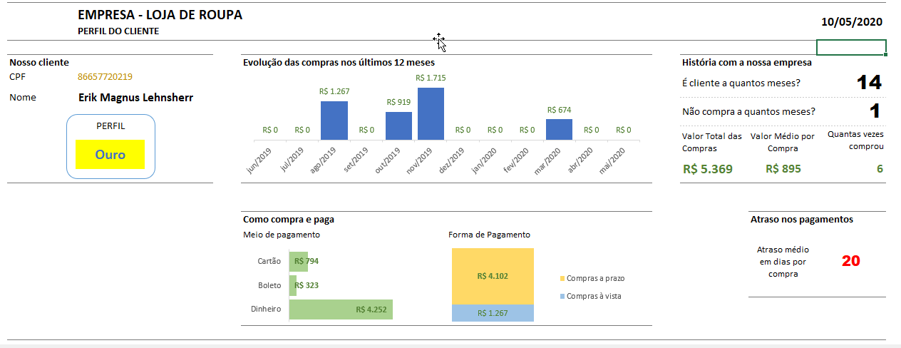
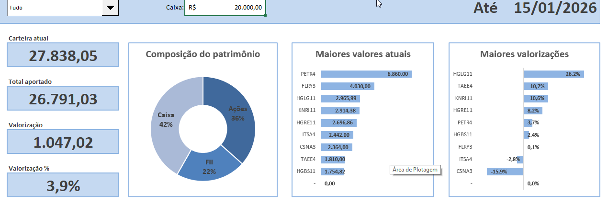
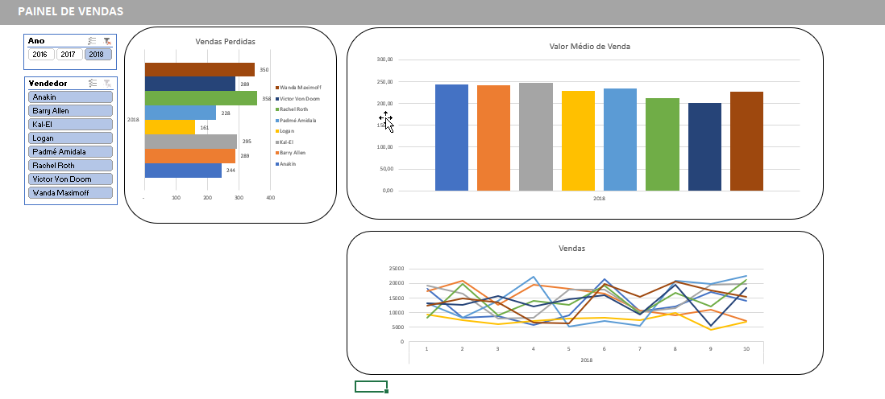

## Projetos

## 1) Projeto Fluxo de Caixa (Excel)

**Problema:** baixa visibilidade do caixa e do resultado mensal/acumulado, dificultando identificar rapidamente saldo, categorias que mais impactam e tendência do período.  
**Solução:** base estruturada de lançamentos (entradas/saídas) + categorização + painel executivo com visão mensal/anual.  
**Entrega:** dashboard financeiro com KPIs de caixa, evolução mensal, distribuição por categoria e resultado acumulado.

**O que o dashboard mostra**
- **KPIs (lado esquerdo):** Saldo de Caixa, Contas a Pagar e Contas a Receber  
- **Tendência mensal (topo/centro):** evolução do resultado ao longo dos meses (linha)  
- **Distribuição (inferior esquerdo):** perfil das vendas / composição por tipo (ex.: à vista x a prazo)  
- **Prazos médios (centro inferior):** atraso médio em dias para **A Receber** e **A Pagar**  
- **Resultado acumulado (inferior centro):** comparação de Entradas x Saídas e saldo do acumulado  
- **Categorias de despesa (inferior direito):** ranking/visão mensal por categoria (ex.: Vestuário)

**Impacto**
- Centraliza o controle financeiro e acelera a leitura do resultado do período  
- Ajuda a identificar rapidamente **onde o caixa está sendo impactado** (categorias e variação mensal)

**Tech / Skills**
- Excel (tabelas, fórmulas, validação de dados)  
- Construção de dashboards, gráficos e KPIs

**Arquivo:** `1. Projeto Fluxo de Caixa.xlsx`

---

## 2) Projeto Perfil do Cliente (Excel)

**Problema:** falta de visão clara sobre comportamento do cliente (perfil, recorrência, ticket e risco), dificultando ações de vendas/relacionamento.  
**Solução:** consolidação de base de compras + segmentação + painel com indicadores de valor e hábitos de consumo.  
**Entrega:** dashboard com perfil do cliente, evolução de compras, composição de pagamentos e métricas de frequência/valor.

**O que o dashboard mostra**
- **KPIs:** número de compras, ticket médio, valor total, atraso médio, recorrência  
- **Gráficos:** evolução das compras (12 meses), composição por forma de pagamento, distribuição de compras  
- **Perfil:** classificação/segmento do cliente (ex.: Ouro) e sinalização de risco (atrasos)

**Impacto**
- Apoia decisões de **segmentação e campanhas** (retenção, upsell e reativação)  
- Identifica rapidamente **clientes valiosos vs. clientes com risco** (atrasos/queda de compras)

**Tech / Skills**
- Excel (tabelas, fórmulas, validação)  
- Dashboards, KPIs, segmentação de clientes

**Arquivo:** `2. Projeto Perfil do cliente.xlsx` 

---

## 3) Projeto Ativos (Excel)

**Problema:** controle descentralizado de investimentos/ativos, dificultando acompanhar patrimônio, evolução e concentração de risco.  
**Solução:** estruturação de carteira + cálculo de métricas financeiras + painel executivo com visão consolidada e comparativos.  
**Entrega:** dashboard de patrimônio com composição, maiores posições e principais valorizações.

**O que o dashboard mostra**
- **KPIs:** total da carteira, total aportado, valorização (R$) e valorização (%)  
- **Distribuição:** composição do patrimônio por classe (ex.: Caixa, FI, Ações)  
- **Ranking:** maiores valores atuais e maiores valorizações (top ativos)

**Impacto**
- Facilita o acompanhamento do **crescimento do patrimônio** e performance da carteira  
- Melhora leitura de **concentração e exposição**, apoiando rebalanceamento

**Tech / Skills**
- Excel (tabelas, fórmulas, dashboards)  
- Indicadores financeiros e visualização executiva

**Arquivo:** `3. Projetos Ativos.xlsx`  

---

## 4) Projeto Painel de Vendas (Excel)

**Problema:** baixa visibilidade do desempenho comercial por período/vendedor e dificuldade em identificar variações e tendências.  
**Solução:** organização de base de vendas + padronização de KPIs + painel gerencial para análise rápida.  
**Entrega:** dashboard de performance com ranking, tendência e comparativos.

**O que o dashboard mostra**
- **KPIs:** volume de vendas, evolução por período, desempenho por vendedor  
- **Gráficos:** vendas por vendedor (ranking), valor médio de venda, linha de tendência de vendas  
- **Filtros:** seleção por ano/período para comparar resultados

**Impacto**
- Acelera análise de performance e identifica **melhores vendedores e gargalos**  
- Suporta decisões de **metas, comissões e estratégias** com base em dados

**Tech / Skills**
- Excel (dashboards, gráficos, segmentação por filtros)  
- KPIs de vendas e análise comparativa

**Arquivo:** `4. Projeto Painel de Vendas.xlsx`  

---

### 5) Projeto de Registro de Pagamento Autônomo
**Arquivo:** `5. Projeto de Registro de Pagamento Autônomo.xlsx`  
**Objetivo:** registrar pagamentos e controlar histórico, valores e status de recebimentos.  
**Destaques:** controle de registros, organização financeira e acompanhamento de pagamentos.

---

### 6) Projeto Financiamento
**Arquivo:** `6. Projeto Financiamento.xlsx`  
**Objetivo:** simular/categorizar informações de financiamento, com visão de parcelas e evolução.  
**Destaques:** visão de prazos, valores e análise de cenários.

---

### 7) Projeto Gerenciamento de Cenários
**Arquivo:** `7. Projeto Gerenciamento de cenários.xlsx`  
**Objetivo:** comparar cenários e apoiar decisões com análises e variações de parâmetros.  
**Destaques:** simulações, análises comparativas e visão de impacto.

---

### 8) Projeto Controle de Estoque
**Arquivo:** `8. Projeto Controle de Estoque.xlsx`  
**Objetivo:** monitorar estoque, entradas/saídas e indicadores para reposição.  
**Destaques:** controle operacional, acompanhamento de itens e organização de inventário.

