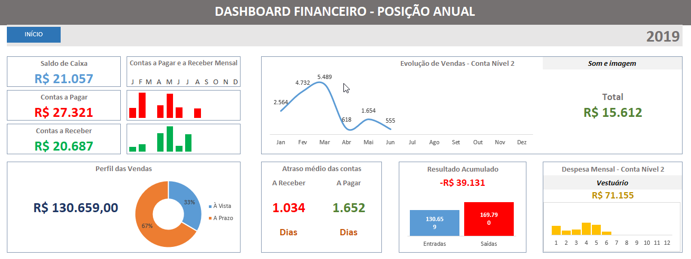
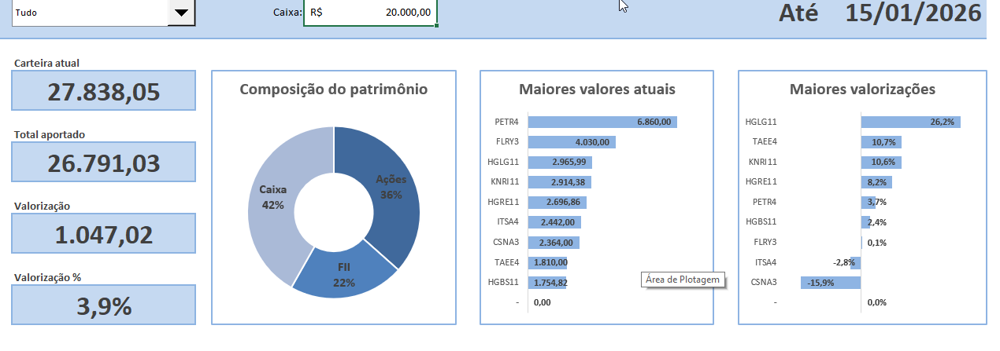
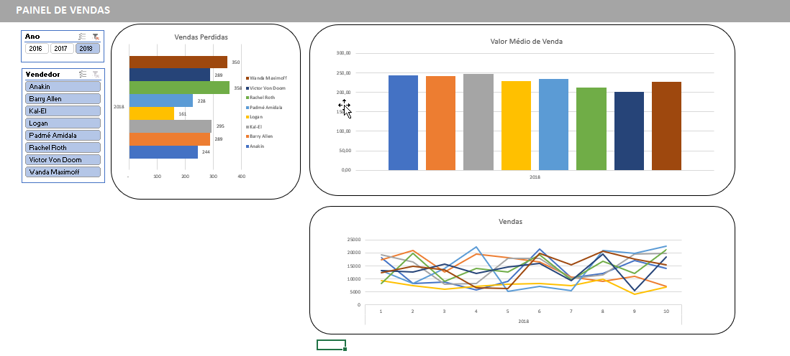

## 📊 Projetos em Excel

### 1) Fluxo de Caixa
**Objetivo:** Dar visibilidade ao saldo, resultado mensal e impacto das categorias.  
**Entrega:** Dashboard financeiro com KPIs, evolução mensal, resultado acumulado e ranking de despesas.  
**Impacto:** Leitura rápida do caixa e identificação imediata dos principais impactos financeiros.  
**Skills:** Excel (fórmulas, tabelas, dashboards, KPIs).  
**Arquivo:** `1. Projeto Fluxo de Caixa.xlsx`

---

### 2) Perfil do Cliente
**Objetivo:** Analisar comportamento, valor e risco dos clientes.  
**Entrega:** Dashboard com perfil do cliente, evolução de compras, formas de pagamento e métricas de recorrência.  
**Impacto:** Suporte à segmentação, retenção e identificação de clientes estratégicos.  
**Skills:** Excel, KPIs, segmentação de clientes.  
**Arquivo:** `2. Projeto Perfil do Cliente.xlsx`

---

### 3) Ativos
**Objetivo:** Acompanhar patrimônio, performance e concentração de investimentos.  
**Entrega:** Dashboard com valor total, aportes, valorização e ranking de ativos.  
**Impacto:** Melhor leitura do crescimento patrimonial e apoio ao rebalanceamento da carteira.  
**Skills:** Excel, indicadores financeiros, visualização executiva.  
**Arquivo:** `3. Projeto Ativos.xlsx`

---

### 4) Painel de Vendas
**Objetivo:** Analisar desempenho comercial por período e vendedor.  
**Entrega:** Dashboard com ranking de vendedores, tendências e comparativos.  
**Impacto:** Identificação rápida de melhores desempenhos e gargalos comerciais.  
**Skills:** Excel, KPIs de vendas, análise comparativa.  
**Arquivo:** `4. Projeto Painel de Vendas.xlsx`

---

### 5) Registro de Pagamentos Autônomos
**Objetivo:** Controlar pagamentos, histórico de recebimentos e status financeiro.  
**Impacto:** Organização e acompanhamento eficiente de pagamentos.  
**Skills:** Excel, controle financeiro.  
**Arquivo:** `5. Projeto de Registro de Pagamento Autônomo.xlsx`

---

### 6) Financiamento
**Objetivo:** Simular financiamentos e analisar parcelas, prazos e cenários.  
**Impacto:** Apoio à análise financeira e tomada de decisão.  
**Skills:** Excel, análise financeira.  
**Arquivo:** `6. Projeto Financiamento.xlsx`

---

### 7) Gerenciamento de Cenários
**Objetivo:** Comparar cenários e avaliar impactos de variações.  
**Impacto:** Suporte à tomada de decisão baseada em dados.  
**Skills:** Excel, simulação e análise de cenários.  
**Arquivo:** `7. Projeto Gerenciamento de Cenários.xlsx`

---

### 8) Controle de Estoque
**Objetivo:** Monitorar estoque, entradas, saídas e indicadores de reposição.  
**Impacto:** Melhor organização do inventário e controle operacional.  
**Skills:** Excel, controle de estoque.  
**Arquivo:** `8. Projeto Controle de Estoque.xlsx`
