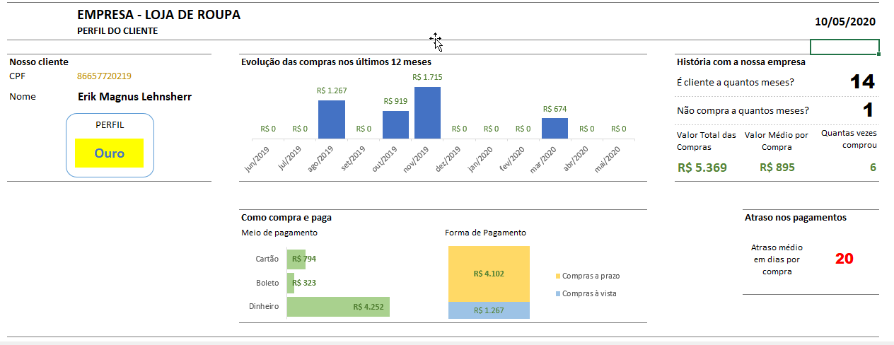
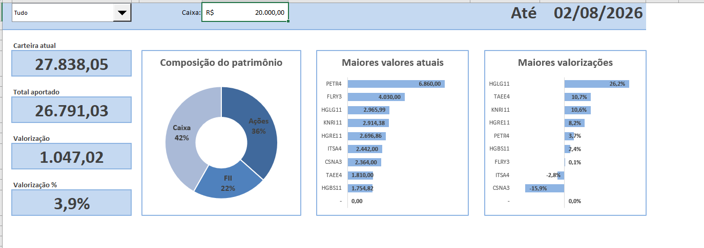

# Projetos em Excel

Este repositório reúne projetos desenvolvidos em **Microsoft Excel**, com foco em análise de dados, dashboards, indicadores e automação de planilhas.

---

## 1. Fluxo de Caixa

**Objetivo:** Desenvolver um dashboard para acompanhamento do fluxo de caixa, permitindo visualizar saldos, evolução financeira e impacto das categorias de receitas e despesas.

**Competências:** Excel, Dashboards, KPIs, Indicadores Financeiros.

**Projeto:** `fluxo-de-caixa`

  

---

## 2. Perfil do Cliente

**Objetivo:** Analisar o comportamento dos clientes por meio de indicadores relacionados ao perfil, recorrência e formas de pagamento.

**Competências:** Excel, Análise de Dados, KPIs, Segmentação de Clientes.

**Projeto:** `perfil-do-cliente`

  

---

## 3. Ativos

**Objetivo:** Acompanhar o desempenho de ativos financeiros por meio de indicadores patrimoniais e gráficos de evolução.

**Competências:** Excel, Indicadores Financeiros, Dashboards, Visualização de Dados.

**Projeto:** `ativos`

  

---

## 4. Painel de Vendas

**Objetivo:** Monitorar o desempenho comercial utilizando indicadores de vendas e comparativos entre períodos.

**Competências:** Excel, KPIs de Vendas, Dashboards, Análise Comercial.

**Projeto:** `painel-de-vendas`

  

---

## 5. Registro de Pagamentos Autônomos

**Objetivo:** Organizar e controlar pagamentos realizados a profissionais autônomos.

**Competências:** Excel, Controle Financeiro, Organização de Dados.

**Projeto:** `registro-de-pagamentos-autonomos`

---

## 6. Financiamento

**Objetivo:** Simular financiamentos, parcelas e diferentes cenários financeiros.

**Competências:** Excel, Matemática Financeira, Simulação de Cenários.

**Projeto:** `financiamento`

---

## 7. Gerenciamento de Cenários

**Objetivo:** Comparar diferentes cenários e avaliar seus impactos sobre os resultados.

**Competências:** Excel, Simulação, Análise de Cenários.

**Projeto:** `gerenciamento-de-cenarios`

---

## 8. Controle de Estoque

**Objetivo:** Monitorar movimentações de estoque e acompanhar indicadores relacionados ao inventário.

**Competências:** Excel, Controle de Estoque, Indicadores.

**Projeto:** `controle-de-estoque`

---

# Autor

**Mark Alves**  
Graduando em Engenharia de Produção
